<div align="center">

<!-- hero: monochrome ASCII portrait (types in) beside a neofetch-style info
     panel. regenerate portrait: python scripts/prep_photo.py <photo> &&
     python scripts/make_ascii_svg.py ; info panel: python scripts/make_info_card.py -->

<!-- animated contribution graph: real data, boxes reveal cell by cell
     (regenerated daily by .github/workflows/update-profile-art.yml) -->

<br/>

<table>
<tr>
<td valign="top"></td>
<td valign="top"></td>
</tr>
</table>

<br>
<br>

<h3><code>fazil@github ~ $ ./links.sh</code></h3>

<p><b>Full Stack Developer</b></p>

[](https://fazilportfolio.me)
[](https://www.linkedin.com/in/fazilkhan01/)
[](https://twitter.com/fazilkhan_07)
[](https://fazilkhan0786.github.io)

<br>

</div>
<!-- IDENTITY CARD WITH GLASS EFFECT -->
<div align="center">
  
### 👨‍💻 `System.init(self)`

```python
class Fazilkhan:
    role        = ["Founder", "Product Architect", "AI/ML Engineer"]
    ventures    = {
        "🏥 NuroVed":   "Healthcare Infrastructure → v1 Active",
        "🎓 Educle":    "EdTech + AI Credibility → Building",
        "🌱 Trashee":   "CleanTech Community → Building", 
        "🧠 Actora":    "Behavioral Design AI → Building"
    }
    philosophy  = "Build systems that change behavior, not just screens"
    metrics     = {"patterns_tested": "10,000+", "ops_uplift": "78%"}
    
    def current_focus(self):
        return "NuroVed v1 → Real-world usability, not demo polish"
```

</div>


<!-- PHILOSOPHY SECTION WITH CUSTOM STYLING -->
<h2 align="center">
   
  Operating Philosophy
</h2>

<div align="center">

| ⚠️ **Don't Optimize For** | ✅ **Optimize For** |
|:---:|:---:|
| Output | **Outcome** |
| Downloads | **Daily Active Usage** |
| Demo Polish | **Real-world Resilience** |
| Vanity Metrics | **Behavior Change** |

</div>

<br/>

<div align="center">

```
┌─────────────────────────────────────────────────────────────┐
│  01 → Why do users drop off here?                          │
│  02 → How does this scale at 10x?                          │
│  03 → Where does AI add real signal — not noise?           │
└─────────────────────────────────────────────────────────────┘
```

</div>


<!-- VENTURES SECTION WITH RICH CARDS -->
<h2 align="center">
  
  Active Ventures
</h2>

<div align="center">

<!-- Venture 1: NuroVed -->
<table>
  <tr>
    <td width="50%">
      <div align="center">
        
        <br><br>
        
        
        <br><br>
        <b>Eliminates fragmentation</b> in patient experience, clinical workflows, and accessibility.
        <br><br>
        
        <br>
        <sub><code>FastAPI</code> <code>Flutter</code> <code>NLP</code> <code>AI/ML</code></sub>
      </div>
    </td>
    <td width="50%">
      <div align="center">
        
        <br><br>
        
        
        <br><br>
        <b>End-to-end operations</b> management with AI-driven student credibility systems.
        <br><br>
        
        <br>
        <sub><code>React</code> <code>Supabase</code> <code>Analytics</code> <code>AI</code></sub>
      </div>
    </td>
  </tr>
  <tr>
    <td width="50%">
      <div align="center">
        
        <br><br>
        
        
        <br><br>
        <b>Community-driven</b> environmental reporting at scale. Turns citizens into change-makers.
        <br><br>
        
        <br>
        <sub><code>IoT</code> <code>Geo-mapping</code> <code>Firebase</code> <code>Gamification</code></sub>
      </div>
    </td>
    <td width="50%">
      <div align="center">
        
        <br><br>
        
        
        <br><br>
        <b>Attacks the dopamine loop</b> directly. Rewires triggers that cause drift.
        <br><br>
        
        <br>
        <sub><code>Behavioral AI</code> <code>React Native</code> <code>Habit Loops</code></sub>
      </div>
    </td>
  </tr>
</table>

</div>

<!-- ANIMATED DIVIDER -->


<!-- TECH STACK WITH SKILL ICONS -->
<h2 align="center">
  
  Technical Architecture
</h2>

<div align="center">

### Languages & Core
<p>
  
</p>

### Frontend & Mobile
<p>
  
</p>

### Backend & Cloud
<p>
  
</p>

### AI / ML / Data
<p>
  
</p>

### DevOps & Tools
<p>
  
</p>

</div>

<!-- ANIMATED DIVIDER -->


<!-- SHIPPED SYSTEMS WITH BETTER VISUALS -->
<h2 align="center">
  
  Shipped Systems
</h2>

<div align="center">
  <i>Real products. Real constraints. Real results.</i>
</div>

<br/>

<div align="center">

| Project | Tech Stack | Impact |
|---------|-----------|--------|
| **🤚 Air Drawing & 3D Canvas** | MediaPipe, OpenCV, Depth Estimation | Gesture-to-drawing without hardware |
| **🩺 Health Record Analyser** | NLP, PyTorch, PDF Parsing | Multi-visit clinical pattern detection |
| **🔬 AI Symptom Analyser** | Medical Ontologies, Model Inference | 10,000+ disease patterns validated |
| **🥗 AI Diet Planner** | PyTorch, Personalization Engine | 500+ dietary scenarios handled |
| **🧪 Food Product Scanner** | NLP, OCR, Ingredient Graph | Real-time offline label analysis |
| **🤖 MAVIS AI Assistant** | LLM, Context Management | Multi-intent automation engine |
| **📊 Pharmacy Dashboard** | React, FastAPI, Supabase | **78% operational uplift** |

</div>

<br/>

<details>
<summary><b>🔍 View Detailed System Architecture</b></summary>
<br/>

**🤚 Air Drawing & 3D Interactive Canvas**
```yaml
Type: Computer Vision System
Tech: MediaPipe, OpenCV, Depth Estimation, Custom Gesture Classifiers
Innovation: Extended 2D canvas into full 3D interactive space
Status: Production Ready
```

**🩺 Health Record Analyser**
```yaml
Type: NLP Clinical Engine
Tech: PyTorch, PDF Parsing, Clinical Pattern Detection
Features: Multi-visit context awareness, Anomaly flagging
Status: Deployed
```

**🔬 AI Symptom Analyser**
```yaml
Type: Diagnostic AI Layer
Validation: 10,000+ disease patterns
Approach: Symptom co-occurrence modeling beyond keyword matching
Status: Active Inference
```

</details>


<!-- EXPERIENCE TIMELINE WITH ICONS -->
<h2 align="center">
  
  Experience
</h2>

<div align="center">

| Period | Role | Company | Impact |
|:------:|:----:|:-------:|:------:|
| `Present` | **Product Architect** | Promacle | Full lifecycle ownership<br>System design → Production |
| `2023` | **Lead Developer** | Dprofiz Ltd | IoT Waste Management<br>Reward systems architecture |
| `2022` | **AI/ML Engineer** | MiroFish AI | End-to-end AI pipelines<br>Context-aware automation |

</div>


<!-- GITHUB STATISTICS WITH RICH VISUALS -->
<h2 align="center">
  
  GitHub Analytics
</h2>

<div align="center">
  
<!-- Stats Grid -->
<a href="https://github.com/fazilkhan0786">
  
</a>
<a href="https://github.com/fazilkhan0786">
  
</a>

<br/><br/>

<!-- Streak Stats -->
<a href="https://github.com/fazilkhan0786">
  
</a>

<br/><br/>

<!-- Contribution Graph -->
<a href="https://github.com/fazilkhan0786">
  
</a>

</div>

<!-- SNAKE ANIMATION -->
<div align="center">
  
</div>


<!-- CURRENT FOCUS WITH NEON EFFECT -->
<h2 align="center">
  
  Right Now
</h2>

<div align="center">

```diff
@@ NuroVed v1          → Real-world usability as the benchmark @@
@@ Educle              → AI-driven student credibility layer    @@
@@ Actora              → Behavioral design that makes decisions stick @@
@@ AI behavior loops   → How model outputs shape product retention @@
@@ System design       → Distributed architecture & failure modes @@
```

</div>

<br/>

<div align="center">
  
  
</div>

<!-- ANIMATED DIVIDER -->


<!-- CONNECT SECTION -->
<h2 align="center">
  
  Let's Build Together
</h2>

<div align="center">

<p>
  <i>Serious builders working on problems that matter — product-first, AI-enabled, systems-aware.</i><br>
  <b>Not chasing hype. Looking for leverage.</b>
</p>

<br>

<!-- Social Links with Hover Effects -->
<a href="https://www.linkedin.com/in/fazilkhan-malek-392082377">
  
</a>
&nbsp;
<a href="mailto:malekfazilkhan01@gmail.com">
  
</a>
&nbsp;
<a href="https://github.com/fazilkhan0786">
  
</a>
&nbsp;
<a href="https://fazilportfolio.me">
  
</a>

<br><br>

<!-- QUOTE CARD -->


</div>

<!-- FOOTER -->
<div align="center">
  
  
  
  <sub>Made with ⚡ by Fazilkhan Malek | Founder Mode: <b>ON</b></sub>

</div>